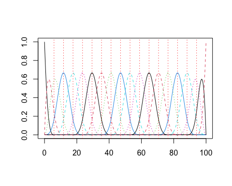
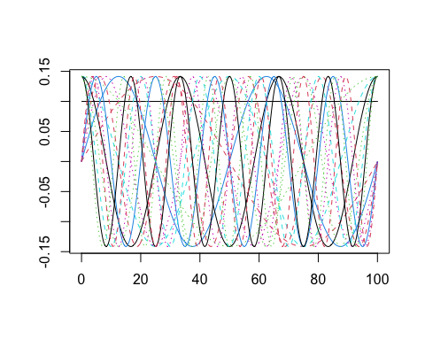

Part 1: Data Representation and Smoothing
================

<center>

 


</center>
<style>
.colored {
  background-color: #DDDDDD;
}
</style>

# Load Packages

``` r
library(fda) # load the fda package
```

------------------------------------------------------------------------

------------------------------------------------------------------------

# Structure of the `fda` package

The `fda` package represents functional observations (i.e., *curves*)
using a **basis function expansion**. That is, each functional
observation $x_i(t), \ i = 1, \dots, N$ is represented as a linear
combination (or weighted sum) of known basis functions
$\{\phi_k(t)\}_{k=1}^k$ as:

$$x_i (t)=\sum_{k=1}^{K} c_{ik} \phi_k(t).$$

This means that our representation of a functional dataset
$x_1(t), \dots, x_N(t)$ should comprise two component parts:

1.  The set of known **basis functions** $\{ \phi_K(t) \}_{k=1}^K$.
    These are *common to all curves*. They are defined in the `fda`
    package as a `basisfd` class.

2.  The basis coefficients $c_{ik}$. We need $K$ basis coefficients
    (i.e., 1 coefficient per basis function) to define each individual
    functional observation. Therefore, for the full dataset of $N$
    observations we have an $K \times N$ matrix of basis coefficients.

<details>
<summary>
<b>Construct a cubic B-spline basis with 20 basis functions</b>
</summary>

``` r
bspl_20 <- create.bspline.basis(rangeval = c(0, 100), # range of t values
                                nbasis = 20, # number of basis functions
                                norder = 4) # order of the piecewise polynomial (4 = cubic)

# show it is a `basisfd` object
class(bspl_20)
```

    ## [1] "basisfd"

``` r
# or 
is.basis(bspl_20)
```

    ## [1] TRUE

``` r
# plot our basis
plot(bspl_20)
```


</details>
<details>
<summary>
<b>Construct a Fourier basis with 20 basis functions</b>
</summary>

``` r
fourier_20 <- create.fourier.basis(rangeval = c(0, 100), # range of t values
                                nbasis = 20) # number of basis functions

# plot our basis
plot(fourier_20)
```


</details>

------------------------------------------------------------------------

In the `fda` package, we combine these two component parts to produce a
`fd` (“functional data”) object. If we know the basis function system
and the matrix of basis coefficients, the code to set up the `fd` object
is very simple.

# Producing smooth functions from noisy observations

In most cases we don’t know the basis coefficients, we have to estimate
or calculate them from noisy sampled measurements.

# Summarising `fd` objects

Mean – show mean of coefficients.

Covariance – just calculation

Boxplot – add more.

# References

- Ramsay, J. O., Hooker, G., & Graves, S. (2009). Functional Data
  Analysis with R and MATLAB. Springer-Verlag.
  <https://doi.org/10.1007/978-0-387-98185-7>
