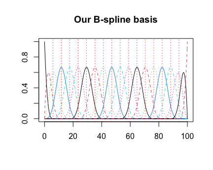
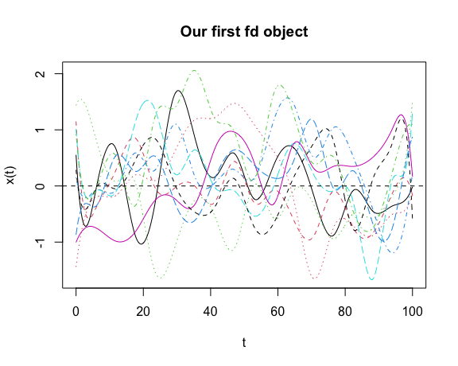
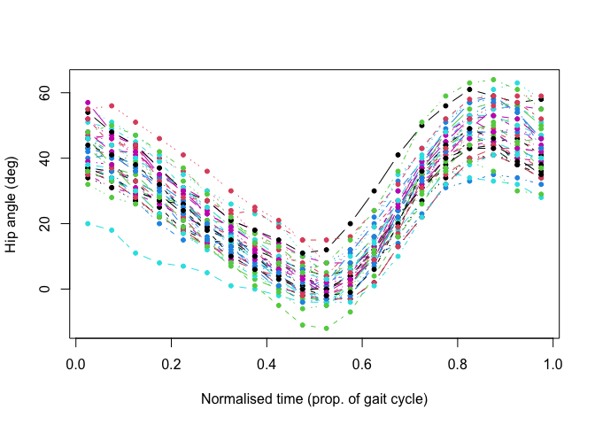
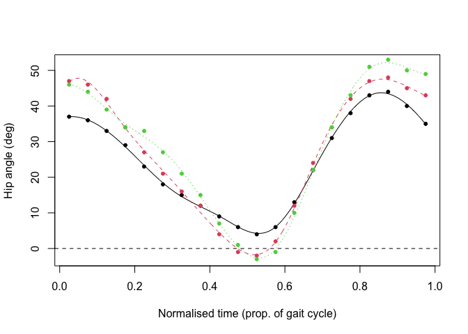
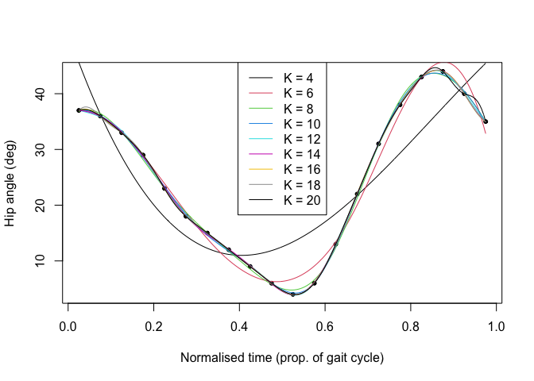
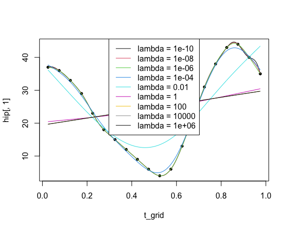
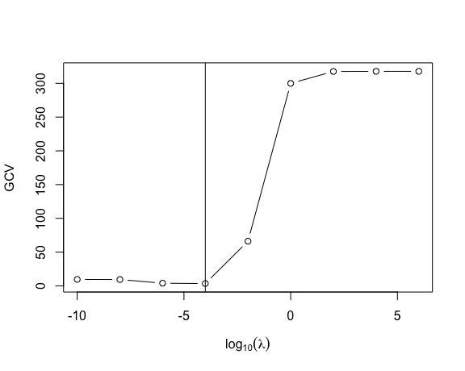
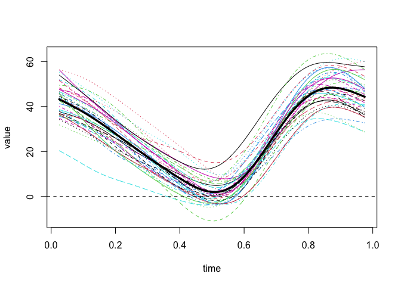
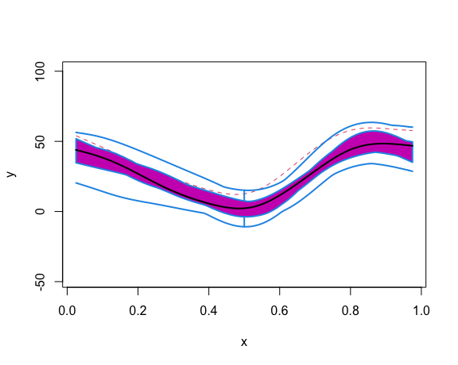
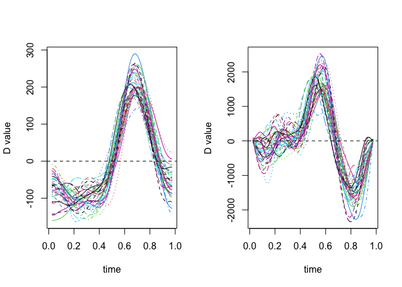

Part 1: Data Representation and Smoothing
================

<<<<<<< HEAD
- <a href="#1-load-packages" id="toc-1-load-packages">1 Load Packages</a>
- <a href="#2-the-fd-class" id="toc-2-the-fd-class">2 The <code>fd</code>
  Class</a>
- <a href="#3-the-childrens-gait-data"
  id="toc-3-the-childrens-gait-data">3 The Children’s Gait Data</a>
- <a href="#4-producing-smooth-functions-from-noisy-observations"
  id="toc-4-producing-smooth-functions-from-noisy-observations">4
  Producing Smooth Functions from Noisy Observations</a>
- <a href="#5-extra-working-with-fd-objects"
  id="toc-5-extra-working-with-fd-objects">5 <strong>Extra</strong>:
  Working with <code>fd</code> Objects</a>
- <a href="#6-references" id="toc-6-references">6 References</a>
=======
- [1 Load Packages](#1-load-packages)
- [2 The `fd` Class](#2-the-fd-class)
- [3 Producing Smooth Functions from Noisy
  Observations](#3-producing-smooth-functions-from-noisy-observations)
- [4 **Extra**: Working with `fd`
  Objects](#4-extra-working-with-fd-objects)
- [5 References](#5-references)
>>>>>>> a3c9d46543f65fafb78a90547f775f7ad91f938f

<center>

 


</center>

# 1 Load Packages

``` r
library(fda) # load the fda package
```

------------------------------------------------------------------------

------------------------------------------------------------------------

# 2 The `fd` Class

The `fda` package represents functional observations (i.e., *curves*)
using a **basis function expansion**. That is, each functional
observation $x_i(t), \ i = 1, \dots, N$ is represented as a linear
combination (or weighted sum) of known basis functions
$\\{\phi_k(t)\\}_{k=1}^K$ as:

$$x_i (t)=\sum_{k=1}^{K} c_{ik} \phi_k(t).$$

This means that our representation of a functional dataset
$x_1(t), \dots, x_N(t)$ should comprise two component parts:

1.  The set of known **basis functions** $\\{ \phi_k(t) \\}_{k=1}^K$.
    These are *common to all curves*. They are defined in the `fda`
    package as a `basisfd` class.

2.  The **basis coefficients** $c_{ik}$. We need $K$ basis coefficients
    (i.e., 1 coefficient per basis function) to define each individual
    functional observation. Therefore, for the full dataset of $N$
    observations we have an $K \times N$ matrix of basis coefficients.

**Examples:**

<details>
<summary>

<b>Construct a cubic B-spline basis with 20 basis functions</b>

</summary>

``` r
bspl_20 <- create.bspline.basis(rangeval = c(0, 100), # range of t values
                                nbasis = 20, # number of basis functions
                                norder = 4) # order of the piecewise polynomial (4 = cubic)

# show it is a `basisfd` object
class(bspl_20)
```

    ## [1] "basisfd"

``` r
# or 
is.basis(bspl_20)
```

    ## [1] TRUE

``` r
# plot our basis
plot(bspl_20)
```


</details>
<details>
<summary>

<b>Construct a Fourier basis with 15 basis functions</b>

</summary>

``` r
fourier_15 <- create.fourier.basis(rangeval = c(0, 100), # range of t values
                                nbasis = 15) # number of basis functions

# plot our basis
plot(fourier_15)
```


</details>

------------------------------------------------------------------------

In the `fda` package, we combine these two component parts to produce a
`fd` (“functional data”) object. If we know the basis function system
and the matrix of basis coefficients, the code to set up the `fd` object
is very simple. We will walk through a short example.

Let’s first set up a basis of $20$ cubic B-spline basis functions on
$[0,100]$.

``` r
bspl_20 <- create.bspline.basis(rangeval = c(0, 100), nbasis = 20, norder = 4)
plot(bspl_20)
title("Our B-spline basis")
```



Now, let’s imagine we have $N=10$ functional observations. We require a
$20\times10$ matrix of basis coefficients. In practice we would
calculate or know these. However, for the purposes of this demonstration
we will just simulate them randomly on our computer.

``` r
set.seed(1996) # so random draws are the same
C <- matrix(rnorm(20*10), nrow = 20, ncol = 10) # 20x10 matrix of random values
```

Now that we have our basis object and our matrix of basis coefficients,
we can set up our `fd` object using the `fd()` function.

``` r
toy_fd <- fd(coef = C, basisobj = bspl_20)
```

Let’s inspect our first `fd` object.

``` r
class(toy_fd) # (or can do is.fd(toy_fd))
```

    ## [1] "fd"

``` r
plot(toy_fd, xlab = "t", ylab = "x(t)")
```

    ## [1] "done"

``` r
title("Our first fd object")
```



**Note**: For more information on building `fd` objects, see Ramsay,
Hooker and Graves (2009, pp. 29-31).

------------------------------------------------------------------------

# 3 The Children’s Gait Data

For this practical we will use the children’s gait dataset – we want to
convert the discrete noisy measurements of each child’s hip angle to
smooth functions.

The data are already loaded (once we have loaded the `fda` package) in
an object named `gait`, so we can inspect them as follows (type `?gait`
for more information):

``` r
gait
```

    ## , , Hip Angle
    ## 
    ##       boy1 boy2 boy3 boy4 boy5 boy6 boy7 boy8 boy9 boy10 boy11 boy12 boy13
    ## 0.025   37   47   46   37   20   57   46   46   46    35    38    35    34
    ## 0.075   36   46   44   36   18   48   38   46   42    34    37    31    31
    ## 0.125   33   42   39   27   11   44   33   43   37    29    33    29    27
    ## 0.175   29   34   34   20    8   35   25   40   34    28    29    26    23
    ## 0.225   23   27   33   15    7   31   18   36   31    19    26    22    19
    ## 0.275   18   21   27   15    5   27   15   30   25    15    20    19    15
    ## 0.325   15   16   21   10    1   21   14   24   19    13    14    15    13
    ## 0.375   12   12   15    6    0   18   10   17   17     6     9    11    10
    ## 0.425    9    4    7    3   -2   14    8   12   13     0     3     6     6
    ## 0.475    6   -1    1    0   -4   10    4    7   10    -1    -2     3     1
    ## 0.525    4   -2   -3    3   -4    8    0    1    5     2    -1     0     0
    ## 0.575    6    2   -1    4    1    8    3    3    7    11     5     4     3
    ## 0.625   13   12   10   10   10   11    9   12   13    20    15    16     8
    ## 0.675   22   24   22   14   18   21   19   24   21    30    24    27    16
    ## 0.725   31   34   34   23   27   32   31   35   29    39    36    35    27
    ## 0.775   38   42   43   31   36   40   37   44   39    45    44    41    34
    ## 0.825   43   47   51   33   34   49   46   49   47    48    47    44    40
    ## 0.875   44   48   53   35   33   55   45   49   51    48    45    45    41
    ## 0.925   40   45   50   34   32   56   46   47   52    43    42    40    39
    ## 0.975   35   43   49   32   28   55   41   43   47    39    40    39    36
    ##       boy14 boy15 boy16 boy17 boy18 boy19 boy20 boy21 boy22 boy23 boy24 boy25
    ## 0.025    43    43    40    51    52    36    35    46    43    55    39    37
    ## 0.075    41    37    41    49    46    33    37    38    41    51    38    34
    ## 0.125    36    35    36    45    41    28    33    30    37    47    31    30
    ## 0.175    31    28    32    39    35    22    27    23    30    41    27    27
    ## 0.225    26    26    27    31    31    18    22    17    24    35    21    26
    ## 0.275    20    21    20    23    24    13    14    13    16    30    14    19
    ## 0.325    16    20    17    16    18    11     9     7    12    26     9    15
    ## 0.375    13    15    10     9    12     7     6     3     8    23     9    10
    ## 0.425    10    13     5     4     6     1     4     0     5    20     6     4
    ## 0.475     8     7    -2     0     3    -2    -1    -3     2    11     4     0
    ## 0.525     4     3    -4    -5     2    -3     1    -3     1     8     2     0
    ## 0.575    12     8    -2     1     5    -3     2     1     8    10     3     4
    ## 0.625    19    16     7    10    12     2    11    11    16    19    13    12
    ## 0.675    27    25    24    21    22    13    17    20    24    35    30    22
    ## 0.725    37    35    38    33    32    22    34    36    33    41    37    31
    ## 0.775    41    43    49    44    42    32    35    48    42    52    47    40
    ## 0.825    44    49    57    51    46    39    40    55    48    57    53    43
    ## 0.875    44    50    59    55    48    41    43    57    48    61    53    43
    ## 0.925    41    45    54    56    49    38    43    56    48    63    49    38
    ## 0.975    37    46    46    51    46    34    42    50    46    58    44    38
    ##       boy26 boy27 boy28 boy29 boy30 boy31 boy32 boy33 boy34 boy35 boy36 boy37
    ## 0.025    36    36    42    38    46    54    52    32    46    46    48    44
    ## 0.075    33    33    40    34    47    48    44    28    41    44    42    41
    ## 0.125    28    30    40    30    44    44    44    26    38    40    42    38
    ## 0.175    22    28    34    23    37    37    33    22    31    35    35    32
    ## 0.225    18    21    23    17    29    30    28    19    25    31    30    24
    ## 0.275    13    15    15    12    23    27    27    13    20    25    23    18
    ## 0.325    11     8    11     8    19    21    23     8    13    19    19    10
    ## 0.375     7     1     7     4    14    18    24     5     7    15    14     6
    ## 0.425     1    -5     5     1     8    15    19    -1     1    10     9     3
    ## 0.475    -2   -11     6     0     3    11    15    -6    -4     5     4     0
    ## 0.525    -3   -12     8    -4    -2    12    15    -5    -3     3    -1    -2
    ## 0.575    -3    -7    12    -4     1    20    16     0    -2     6     3    -1
    ## 0.625     2     4    22     1    12    30    24    12     8    14     9     6
    ## 0.675    13    16    33    10    26    41    32    22    22    27    25    20
    ## 0.725    22    26    43    22    39    50    43    30    34    40    37    36
    ## 0.775    32    37    51    32    48    56    52    36    45    48    45    44
    ## 0.825    39    44    57    38    52    61    58    39    53    53    52    49
    ## 0.875    41    47    58    41    48    59    59    36    57    53    53    46
    ## 0.925    38    44    54    41    43    57    57    30    55    50    52    38
    ## 0.975    34    37    46    40    42    58    52    29    43    47    46    35
    ##       boy38 boy39
    ## 0.025    55    48
    ## 0.075    56    50
    ## 0.125    51    47
    ## 0.175    46    42
    ## 0.225    41    37
    ## 0.275    36    29
    ## 0.325    30    22
    ## 0.375    25    14
    ## 0.425    21     8
    ## 0.475    15     5
    ## 0.525     8     8
    ## 0.575     5    15
    ## 0.625     9    24
    ## 0.675    19    36
    ## 0.725    31    51
    ## 0.775    43    59
    ## 0.825    52    63
    ## 0.875    56    64
    ## 0.925    59    61
    ## 0.975    59    55
    ## 
    ## , , Knee Angle
    ## 
    ##       boy1 boy2 boy3 boy4 boy5 boy6 boy7 boy8 boy9 boy10 boy11 boy12 boy13
    ## 0.025   10   16   18    5    2   15   13   14   15     9    13     7     9
    ## 0.075   15   25   27   14    6   17   16   17   20    22    24     8    14
    ## 0.125   18   28   32   16    6   23   22   18   23    25    27    11    16
    ## 0.175   18   25   32   17    6   23   17   19   26    21    23    12    15
    ## 0.225   15   18   28   10    5   20   12   19   25    10    18     8    15
    ## 0.275   14   12   23    8    6   19    9   15   21     9    13     6    12
    ## 0.325   13   10   16    6    6   15    8   11   16     9    12     4    13
    ## 0.375   13    9   11    5    7   13   10    8   13     9    15     5    14
    ## 0.425   15    7    8    5    8    9   14    7    8    11    16     5    14
    ## 0.475   21    9   11    9   15   10   16    8    8    19    19    10    15
    ## 0.525   26   17   18   20   24   14   22   12   10    33    27    19    20
    ## 0.575   39   32   33   40   41   25   36   26   22    55    43    36    31
    ## 0.625   52   51   56   57   59   40   51   47   40    69    60    58    45
    ## 0.675   64   67   72   66   69   58   64   68   56    75    70    70    60
    ## 0.725   70   70   79   67   71   65   71   79   65    77    75    72    71
    ## 0.775   66   66   77   61   66   66   68   76   67    70    69    66    70
    ## 0.825   57   55   67   43   44   61   65   61   61    55    50    51    62
    ## 0.875   40   39   46   18   23   45   40   35   47    36    25    30    45
    ## 0.925   22   23   22    3    5   21   17   13   26    17    13     8    26
    ## 0.975   11   16   14    0    4    9    3    5   10    16     6     5    12
    ##       boy14 boy15 boy16 boy17 boy18 boy19 boy20 boy21 boy22 boy23 boy24 boy25
    ## 0.025    15     6    11    24    16    16     7    21    11    12     8    11
    ## 0.075    20    11    19    32    20    20    13    24    14    17    12    20
    ## 0.125    22    20    30    35    21    22    14    25    14    20    14    22
    ## 0.175    22    18    28    33    20    21    17    21    11    20    13    21
    ## 0.225    21    13    25    29    18    20    14    16     8    18    12    21
    ## 0.275    19     9    17    24    14    20     8     9     5    12     9    17
    ## 0.325    19     9    15    18    13    20     7     4     6    11     7    16
    ## 0.375    19     8    10    14    11    19     7     4     7     9    10    17
    ## 0.425    19    11     7    12     9    16     7     5     8    11     9    15
    ## 0.475    20    12     7    14    11    16     8     9    10    10    13    19
    ## 0.525    25    20    13    20    19    21    17    19    18    16    21    28
    ## 0.575    41    38    25    36    34    31    30    36    36    30    39    42
    ## 0.625    58    56    46    55    53    49    49    56    53    49    59    59
    ## 0.675    70    67    68    69    66    69    60    70    65    68    76    70
    ## 0.725    73    71    79    75    73    74    71    80    72    69    76    73
    ## 0.775    68    65    77    72    72    71    65    80    73    69    71    66
    ## 0.825    53    48    67    60    61    60    58    68    64    63    55    49
    ## 0.875    32    25    48    43    43    41    39    48    46    44    26    24
    ## 0.925    16     5    23    26    22    23    20    27    28    28     8     6
    ## 0.975    10     8    13    16    11    15    10    16    13     8    12     9
    ##       boy26 boy27 boy28 boy29 boy30 boy31 boy32 boy33 boy34 boy35 boy36 boy37
    ## 0.025    16    19    13    11    17    20    18     9     8     9    13    19
    ## 0.075    20    26    23    15    25    20    18    12    10    18    18    23
    ## 0.125    22    28    30    19    30    22    25    16    17    19    27    26
    ## 0.175    21    28    28    20    30    16    23    15    16    19    26    25
    ## 0.225    20    24    19    18    27    10    18    14    12    19    25    21
    ## 0.275    20    18    10    17    22    10    19    11    10    15    18    18
    ## 0.325    20    12     6    15    17    10    21     8     8    12    12    14
    ## 0.375    19     8     5    11    11    12    25     6     4    11    10    13
    ## 0.425    16     7    10     9     7    13    24     5     2    10     9    14
    ## 0.475    16     8    19     9     7    17    25     9     4    12    13    17
    ## 0.525    21    16    33    12    13    28    27    18    12    20    16    24
    ## 0.575    31    33    50    23    31    47    39    39    27    36    33    37
    ## 0.625    49    52    68    40    52    64    59    56    48    56    53    56
    ## 0.675    69    68    79    58    69    72    72    68    66    72    73    73
    ## 0.725    74    78    81    71    75    72    77    71    76    80    77    82
    ## 0.775    71    80    75    70    68    63    69    67    77    75    75    76
    ## 0.825    60    74    61    56    46    47    60    54    71    59    64    59
    ## 0.875    41    57    42    36    21    23    38    30    54    34    44    31
    ## 0.925    23    35    25    19     6     9    17     9    26    10    23     7
    ## 0.975    15    18    16    11     8    19    14     6     3     9    16     7
    ##       boy38 boy39
    ## 0.025    16    14
    ## 0.075    23    25
    ## 0.125    28    32
    ## 0.175    28    34
    ## 0.225    25    30
    ## 0.275    21    20
    ## 0.325    19    12
    ## 0.375    17     7
    ## 0.425    16     6
    ## 0.475    13    11
    ## 0.525    13    24
    ## 0.575    19    45
    ## 0.625    37    67
    ## 0.675    57    79
    ## 0.725    69    82
    ## 0.775    71    76
    ## 0.825    62    65
    ## 0.875    45    46
    ## 0.925    28    25
    ## 0.975    20    15

The data are stored in a $20 \times 39 \times 2$ array – we have $39$
observations (boys) measured at $20$ time points – the hip and the knee
angles are contained in the two array slices.

``` r
dim(gait) # get dimensions of the array
```

    ## [1] 20 39  2

For this practical, we will only focus on the hip angle, which is
contained in the first slice.

``` r
hip <- gait[,,1]
```

We also are provided with an object called `gaittime`, which is a vector
of points that represent the $20$ time points at which the curves are
measured. These have been normalised so that $0.025$ is the first
measured time point and $0.975$ the last.

``` r
(t_grid <- as.numeric(dimnames(gait)[[1]]))
```

    ##  [1] 0.025 0.075 0.125 0.175 0.225 0.275 0.325 0.375 0.425 0.475 0.525 0.575
    ## [13] 0.625 0.675 0.725 0.775 0.825 0.875 0.925 0.975

``` r
# or from help file:
# seq(from=0.025, to=0.975, by=0.05)
```

Now we can plot the data matrix using the `matplot()` command.

``` r
matplot(x = t_grid, 
        y = hip,
        type = "b", # both lines and points
        pch = 20, # dots for points
        xlab = "Normalised time (prop. of gait cycle)",
        ylab = "Hip angle (deg)")
```



**Note:** Although this dataset is small compared to biomechanical
datasets nowadays which might be sampled at $5 \times$ the sampling rate
(or more), it serves as a useful case study for familiarising ourselves
with the implementations of basis expansions and smoothing in the `fda`
package.

------------------------------------------------------------------------

# 4 Producing Smooth Functions from Noisy Observations

In most cases we don’t know the basis coefficients. Instead, we have to
estimate them from noisy sampled measurements of each curve.

For this practical, we’ll assume that we measure each functional
observation on a common grid $T$ points $t_1, \dots, t_T$, and these
measurements are contaminated with some measurement error (or “noise”):
$$y_{ij} = x(t_j) + \epsilon_{ij}.$$

------------------------------------------------------------------------

When creating our `fd` object, we want to recover the underlying
functions $x_1(t), \dots, x_N (t)$ as accurately as possible without
capturing the noise.

We can do this using a basis expansion, choosing a system of basis
functions $\{\phi_k(t)\}$, and then estimating the basis coefficients
according to some criteria.

The most straightforward way to do this is by **Ordinary Least Squares
(OLS)**, where for each curve we choose $c_{i1}, \dots, c_{iK}$ to
minimise the sum of squared errors (SSE):
$$SSE = \sum_{j=1}^T \left(y_{ij} - \sum_{k=1}^K c_{ik} \phi_k(t_j)\right)^2.$$

To compute the basis coefficients by OLS we can use the `smooth.basis()`
function, which takes the following three arguments:

- `argvals`: This is our grid of points $t_1, \dots, t_T$.

- `Y`: This is our $T \times N$ matrix containing the discrete noisy
  measurements of the $N$ curves at the $T$ sampling points.

- `fdParobj`: For OLS, we just supply the `basisobj` we are using to
  represent the curves.

For now, we’ll start with a basis of $10$ cubic B-spline basis
functions.

``` r
bspl_10 <- create.bspline.basis(rangeval = range(t_grid), nbasis = 10, norder = 4)
ols_fdSmooth <- smooth.basis(argvals = t_grid, y = hip, fdParobj = bspl_10)
```

The `smooth.basis()` function returns an `fdSmooth` object. The most
important part of this object is the `fd` element – this is an `fd`
object comprising the basis we have supplied and the coefficients we
have estimated, so it represents our dataset of smoothed curves.

``` r
ols_fd <- ols_fdSmooth$fd # or ols_fdSmooth[["fd]]
plot(ols_fd[1:3,],
     xlab = "Normalised time (prop. of gait cycle)",
     ylab = "Hip angle (deg)")
```

    ## [1] "done"

``` r
matpoints(x = t_grid, y = hip[, 1:3], pch = 20) # overlay
```



With the OLS, the smoothness of the fitted curve is controlled by the
number of basis functions $K$. We’ll choose a single curve, and look at
the fits using different values of $K$:

``` r
plot(t_grid, hip[,1],  # plot raw data (1st curve)
     pch = 20,
    xlab = "Normalised time (prop. of gait cycle)",
    ylab = "Hip angle (deg)")
     
K_seq <- seq(4, 20, by = 2)

for(Ki in seq_along(K_seq)) {
  bspl_K <- create.bspline.basis(rangeval = range(t_grid), nbasis = K_seq[Ki], norder = 4)
  ols_fdSmooth_K <- smooth.basis(argvals = t_grid, y = hip[,1], fdParobj = bspl_K)
  lines(ols_fdSmooth_K$fd, col = Ki)
}
legend("top", legend = paste0("K = ", K_seq), col = seq_along(K_seq), lty = 1)
```



A more flexible approach is to choose a risch basis (i.e., a large value
of $K$) and add a penalty to the SSE criterion that penalises the
roughness of the fitted function
$$PENSSE =  \underbrace{\sum_{j=1}^T \left(y_{ij} - \sum_{k=1}^K c_{ik} \phi_k(t_j)\right)^2}_{SSE} + \lambda \text{PEN}(x(t)).$$
This approach is called **Penalised Ordinary Least Squares (P-OLS)**.
The roughness penalty we will use is on the integrated squared second
derivative of $x(t)$:
$$PEN(x(t)) = \int \left( \frac{\mathrm{d}^2 x(t)}{\mathrm{d}t^2} \right)^2 \mathrm{d}t$$
Applying P-OLS with `smooth.basis()` is very similar to OLS, but we pass
a general `fdPar` object (rather than just our `basisfd` object) to
`fdParobj` argument, to encode information about the basis, the penalty
and the smoothing parameter $\lambda$. We create this object using the
`fdPar()` function, passing the following arguments:

- `fdobj`: here we just supply our basis.

- `Lfdobj`: Here we specify the penalty – `int2Lfd(m = m)` specifies a
  penalty on the integrated squared $m$th derivative of our fitted
  curve, so we set $m=2$ for the second derivative penalty.

- `lambda` specifies the value of the smoothing parameter $\lambda$.

In our case, we’ll use a basis of $20$ basis functions, which is rich
given that the curves are sampled at $20$ points. We pass this to a
`fdPar()` function call using the arguments above to create our
`fdParobj` for P-OLS.

``` r
bspl_20 <- create.bspline.basis(rangeval = range(t_grid), nbasis = 20, norder = 4)
fdParobj_pols <-fdPar(fdobj = bspl_20, Lfdobj = int2Lfd(m = 2), lambda = 1)
```

We then pass the `fdPar` object that we have created to the `fdParobj`
argument in `smooth.basis()` to perform P-OLS smoothing.

``` r
pls_fdSmooth <- smooth.basis(argvals = t_grid, y = hip, fdParobj = fdParobj_pols)
```

Let’s view the effect on the fit of a single curve when we vary
$\lambda$:

``` r
# create grid of values for lambda varying on a log10 scale
log10_lambda_range <- seq(-10, 6, by = 2)
lambda_range <- 10^log10_lambda_range
n_lambda <- length(lambda_range) # how many values we're trialling

plot(x = t_grid, y = hip[, 1], pch = 20) # plot underlying data (first curve)
for(lam in seq_len(n_lambda)) {
  # loop through different lambdas
  fdParobj_lam <- fdPar(fdobj = bspl_20, 
                        Lfdobj = int2Lfd(m = 2),
                        lambda = lambda_range[lam]) # create fdPar with chosen lambda
  # do p-ols with chosen lambda:
  pls_fdSmooth_lam <- smooth.basis(argvals = t_grid, y = hip, fdParobj = fdParobj_lam)
  # extract fd object:
  pls_fd_lam <- pls_fdSmooth_lam$fd
  # overlay line of current fit
  lines(pls_fd_lam[1, ], col = lam)
}
legend("top", legend = paste0("lambda = ", lambda_range), col = seq_len(n_lambda), lty = 1)
```



For choosing an optimal value of $\lambda$, we typically minimise some
measure of fit to the data that is discounted for the complexity of the
model. A common measure is the Generalised Cross Validation (GCV)
criterion (Craven and Wahba, 1979). It is returned automatically as part
of the `fdSmooth` object returned by `smooth.basis()`. In the following,
we loop through a range of values for $\lambda$ to find the one that
provides the minimum GCV value:

``` r
# create vcector to store the GCV values:
gcv_vec <- vector(mode = "numeric", length = n_lambda)

for(lam in seq_len(n_lambda)) {
  # loop through different lambdas
  fdParobj_lam <- fdPar(fdobj = bspl_20, 
                        Lfdobj = int2Lfd(m = 2),
                        lambda = lambda_range[lam]) # create fdPar with chosen lambda
  # do p-ols with chosen lambda:
  pls_fdSmooth_lam <- smooth.basis(argvals = t_grid, y = hip, fdParobj = fdParobj_lam)
  # store resulting GCV:
  gcv_vec[lam] <- mean(pls_fdSmooth_lam$gcv)
}

plot(log10_lambda_range, 
     y = gcv_vec, 
     type = "b", 
     xlab = expression(log[10](lambda)), 
     ylab = "GCV")
best_lambda_index <- which.min(gcv_vec)
abline(v = log10_lambda_range[best_lambda_index])
```



Now let’s set up our final smoothed object as the one returned by
setting $\lambda$ at its optimum value.

``` r
fdParobj_final <- fdPar(fdobj = bspl_20, 
                        Lfdobj = int2Lfd(m = 2),
                        lambda = lambda_range[best_lambda_index]) # create fdPar with chosen 
pls_fdSmooth_final <- smooth.basis(argvals = t_grid, y = hip, fdParobj = fdParobj_final)
final_fd <- pls_fdSmooth_final$fd
```

**Some points to try or discuss in the Q&A:**

- How you would code ordinary cross-validation (leave-one-out and
  $k$-fold)?

- How would you examine regression assumptions using what is returned by
  `smooth.basis()`?

- How would you deal with curves measured at different time points?

# 5 **Extra**: Working with `fd` Objects

Given the `fd()` object, the following are among the many operations we
can use to summarise and explore the functional dataset.

## 5.1 Evaluation

To evaluate the functions on a grid of points we use the `eval.fd()`
function. This returns a $T^* \times N$ matrix, where $T^*$ is the
number of grid points.

``` r
# define coarse grid
t_grid_coarse <- seq(min(t_grid), max(t_grid), length.out = 10)
# evaluate on that grid
eval.fd(evalarg = t_grid_coarse, fdobj = final_fd)
```

    ##            boy1      boy2       boy3      boy4       boy5      boy6      boy7
    ##  [1,] 37.731257 48.235382 46.4583423 38.305033 20.3864957 56.366301 45.713303
    ##  [2,] 32.073285 39.907786 38.8436239 26.521310 11.7965403 41.843369 31.003976
    ##  [3,] 22.391613 26.343912 30.6924174 15.774312  5.9531226 29.886628 18.457215
    ##  [4,] 13.717739 13.865112 18.6268468  8.361172  0.8757273 20.224195 11.839924
    ##  [5,]  6.985262  1.800734  3.8647656  1.988448 -3.3869036 11.752694  5.132169
    ##  [6,]  5.931103  1.118038 -0.4759823  3.409039 -0.3574390  7.979394  2.506539
    ##  [7,] 18.934821 19.434910 17.4804612 13.484453 15.5438223 18.069975 16.032374
    ##  [8,] 36.295580 39.868509 40.9757885 27.876562 31.7070693 38.336759 36.112735
    ##  [9,] 42.842600 47.263971 51.7629823 34.426950 33.9561147 53.053902 45.580987
    ## [10,] 36.234138 43.617809 49.6590591 32.746701 28.6768357 56.398932 42.569573
    ##            boy8      boy9      boy10      boy11     boy12     boy13     boy14
    ##  [1,] 46.736626 45.950339 35.6938733 38.6315878 34.743922 34.228460 43.701989
    ##  [2,] 42.803818 37.339859 29.4714658 32.7640677 28.423927 26.464853 35.360279
    ##  [3,] 34.412490 28.787214 19.5672660 24.0830791 21.608677 18.363306 24.560858
    ##  [4,] 21.609112 18.916248  8.9411629 12.0201001 13.257854 11.396574 14.859944
    ##  [5,]  8.535873 10.688552  0.2136311  0.8018249  4.026547  3.522495  8.116501
    ##  [6,]  3.611486  7.086672  7.0370061  2.8112857  4.031568  1.819145  9.406098
    ##  [7,] 19.637825 17.997488 26.5915340 21.4385017 22.238970 13.988164 24.631231
    ##  [8,] 41.262329 36.766388 43.4465564 41.0941456 39.454912 32.139349 39.892921
    ##  [9,] 48.912778 49.740215 47.1390774 45.5441477 43.826255 40.322505 43.586294
    ## [10,] 44.054990 49.081807 39.7069392 40.2266278 39.124852 36.979973 37.829079
    ##           boy15     boy16      boy17     boy18     boy19     boy20      boy21
    ##  [1,] 42.617409 41.266887 51.8884284 51.839072 36.500185 36.658117 45.7721454
    ##  [2,] 33.087661 35.756428 43.7260473 40.296997 27.027721 31.766274 29.4117850
    ##  [3,] 24.646235 25.570308 29.4485725 28.767168 17.031661 19.851985 16.1638862
    ##  [4,] 17.619874 13.789012 13.5038605 15.635899  8.706618  8.187496  5.6454797
    ##  [5,]  9.131590  1.109798  1.0582019  4.545672 -0.218806  1.251032 -1.9345109
    ##  [6,]  6.909294 -2.137773 -0.5777779  4.006424 -2.829611  2.048863 -0.2210228
    ##  [7,] 21.910640 18.083580 17.2230374 18.742604  9.242329 16.617246 18.1177003
    ##  [8,] 40.962691 46.304411 40.9593579 38.581983 29.483096 34.674673 44.1939287
    ##  [9,] 48.661321 57.368192 54.0598141 47.947310 39.665041 42.245103 56.4086861
    ## [10,] 45.877777 48.102615 53.0115217 47.209767 35.322922 42.714548 51.9187438
    ##           boy22    boy23     boy24     boy25     boy26     boy27     boy28
    ##  [1,] 43.905938 55.31488 40.045095 36.998582 36.500185 36.116793 42.802720
    ##  [2,] 35.360814 45.65771 31.124270 30.277071 27.027721 30.012300 37.316206
    ##  [3,] 22.122128 34.34703 19.185834 23.285875 17.031661 19.943753 22.338565
    ##  [4,] 10.301545 24.94100  9.452122 12.783786  8.706618  5.378813  9.236234
    ##  [5,]  3.012074 14.70730  4.048517  2.274121 -0.218806 -8.120621  5.007379
    ##  [6,]  5.469492 10.48831  4.057032  2.655604 -2.829611 -8.316645 10.863622
    ##  [7,] 21.324800 27.71711 22.670788 18.552573  9.242329 11.248921 29.141107
    ##  [8,] 39.593152 49.04575 44.731676 36.964897 29.483096 34.441798 49.341327
    ##  [9,] 48.187316 60.36407 52.293179 42.267902 39.665041 45.365100 56.817678
    ## [10,] 46.816105 59.96603 45.193461 37.858835 35.322922 39.081806 47.955465
    ##            boy29     boy30    boy31    boy32     boy33     boy34     boy35
    ##  [1,] 38.4167453 47.572940 53.98733 51.53904 31.831029 46.096964 46.565480
    ##  [2,] 28.3077008 41.882303 42.27248 39.81402 25.236633 36.241376 39.293065
    ##  [3,] 16.2253144 28.742231 30.02046 28.73058 17.129570 24.124711 29.291802
    ##  [4,]  6.5160750 16.623972 19.94386 23.20440  6.705325 10.717946 17.712680
    ##  [5,] -0.3329357  4.735144 12.73924 17.19935 -3.234897 -1.328975  7.119077
    ##  [6,] -3.3767756  1.344917 17.17284 16.17881 -1.089502 -1.923146  5.376099
    ##  [7,]  7.7069181 21.144034 36.86148 29.68228 17.901495 16.905147 22.893058
    ##  [8,] 28.6958504 44.841253 54.61237 49.47652 34.408799 42.569326 45.486550
    ##  [9,] 40.2348007 48.883741 59.54927 58.35588 36.026475 55.192825 52.732685
    ## [10,] 40.9052442 41.711979 57.69314 53.45203 28.667015 46.418056 47.741372
    ##           boy36      boy37     boy38     boy39
    ##  [1,] 47.654803 44.5850082 56.345192 49.455492
    ##  [2,] 39.504417 36.4127647 50.390453 46.081566
    ##  [3,] 28.449804 22.9919821 40.019102 34.838889
    ##  [4,] 16.909031  9.2773030 28.689096 18.766306
    ##  [5,]  5.707535  0.5851994 16.955536  6.914409
    ##  [6,]  2.014854 -0.8846594  7.179916 11.664418
    ##  [7,] 19.395328 16.3992298 16.017894 32.899011
    ##  [8,] 43.111357 41.2234621 39.423053 56.303527
    ##  [9,] 52.666491 45.7143377 55.443048 63.452179
    ## [10,] 47.748611 35.0994095 60.171421 56.455307

## 5.2 Mean Function

The sample mean function
$$\bar{x}(t) = \frac{1}{N}\sum_{i=1}^N x_i(t),$$ can be calculated using
the `mean.fd()` function.

``` r
mean_fd <- mean.fd(x = final_fd)
```

However, as the mean functional object is just given by the mean of the
coefficients combined with the same basis, we can do this manually as
follows.

``` r
final_coef <- final_fd$coef # extract coefficients
mean_coef <- apply(final_coef, 1, mean) # average them
mean_fd_02 <- fd(coef = mean_coef, basisobj = final_fd$basis) # create mean fd object manually
```

Let’s overlay the mean on a plot of the data:

``` r
plot(final_fd)
```

    ## [1] "done"

``` r
lines(mean_fd, lwd = 3)
lines(mean_fd_02, lwd = 3)
```



## 5.3 Covariance

The sample covariance function
$$\text{Cov}(x(s), x(t)) = \frac{1}{N-1}\sum_{i=1}^N (x_i(s)-\bar{x}(s))(x_i(t)-\bar{x}(t)),$$
summarises the dependence among the function values at time $s$ and time
$t$. It is a bivariate function on a two-dimensional (i.e., rectangular)
domain. We can compute it for our sample of functional data using the
`var.fd()` function as follows.

``` r
cov_fd <- var.fd(fdobj1 = final_fd)
```

The result is a `bifd` (“bivariate functional data”) object. We can
evaluate it on a two-dimensional grid as follows.

``` r
cov_eval <- eval.bifd(sevalarg = t_grid, tevalarg =  t_grid, bifd = cov_fd)
```

It can then be visualised using a surface plot, a contour plot or a
filled contour plot. Here, we will create a filled contour plot using
`filled.contour()`.

``` r
filled.contour(x = t_grid, y = t_grid, z = cov_eval)
```


## 5.4 Boxplots

Just as the scalar boxplot provides a simple and intepretable
five-number summary for scalar data, the *functional boxplot* (Sun and
Genton, 2009) is a summary graphic for functional data. We produce it
using the `boxplot.fd()` function as follows.

``` r
boxplot.fd(x = final_fd)
```



    ## $depth
    ##      boy1      boy2      boy3      boy4      boy5      boy6      boy7      boy8 
    ## 0.4620061 0.5022782 0.4404938 0.2711482 0.1482610 0.3386780 0.4717334 0.3961999 
    ##      boy9     boy10     boy11     boy12     boy13     boy14     boy15     boy16 
    ## 0.4324769 0.3989391 0.5020243 0.4539357 0.3524940 0.4409615 0.4656939 0.4203578 
    ##     boy17     boy18     boy19     boy20     boy21     boy22     boy23     boy24 
    ## 0.3994736 0.4792159 0.2421367 0.4312476 0.3294317 0.5100279 0.1544341 0.4587592 
    ##     boy25     boy26     boy27     boy28     boy29     boy30     boy31     boy32 
    ## 0.4771449 0.2421367 0.2801940 0.3732847 0.2280969 0.4491656 0.1742895 0.2221910 
    ##     boy33     boy34     boy35     boy36     boy37     boy38     boy39 
    ## 0.2307692 0.4220013 0.4134098 0.4701835 0.4539758 0.2152563 0.1795005 
    ## 
    ## $outpoint
    ## [1] 31
    ## 
    ## $medcurve
    ## boy22 
    ##    22

- The black curve is the *functional median*, i.e., the most “typical”
  curve in the data.

- The middle pink envelope, enclosed by the inner blue lines represents
  the range of the $50\%$ most typical curves.

- The outer blue lines can be views as analogous to whiskers on a
  traditional boxplot.

- The red curves are outliers, identified by crossing a threshold
  (obtained by extending the middle envelope by $1.5$ times its width)
  at any point in the time domain.

## 5.5 Derivatives

Given a representation of a function $x(t)$, examining the derivatives
(i.e., rates of change) of that function with respect to its argument
$t$ is often of interest. We let $\frac{d^m x(t)}{dt^m}$ represent the
$m$th derivative of $x(t)$ with respect to time. For example, from
observed displacement data, we might wish to calculate estimates of
velocity (the first derivative) or acceleration (second derivative).

``` r
velocity <- deriv.fd(expr = final_fd, Lfdobj = 1) # 1st derivative
acceleration <- deriv.fd(expr = final_fd, Lfdobj = 2) # 2nd derivative
par(mfrow = c(1, 2))
plot(velocity)
```

    ## [1] "done"

``` r
plot(acceleration)
```



    ## [1] "done"

**Note:** If we were really interested in acceleration estimates, we
would use a quintic (order 6, rather than 4) spline to represent
displacement so that it’s second derivative would be represented by
piecewise cubic polynomials.

------------------------------------------------------------------------

# 6 References

- Ramsay, J. O., Hooker, G., & Graves, S. (2009). Functional Data
  Analysis with R and MATLAB. Springer-Verlag.
  <https://doi.org/10.1007/978-0-387-98185-7>

- Craven, P., & Wahba, G. (1978). Smoothing noisy data with spline
  functions. Numerische Mathematik, 31(4), 377–403.
  <https://doi.org/10.1007/BF01404567>

- Sun, Y., & Genton, M. G. (2011). Functional Boxplots. Journal of
  Computational and Graphical Statistics, 20(2), 316–334.
  <https://doi.org/10.1198/jcgs.2011.09224>
