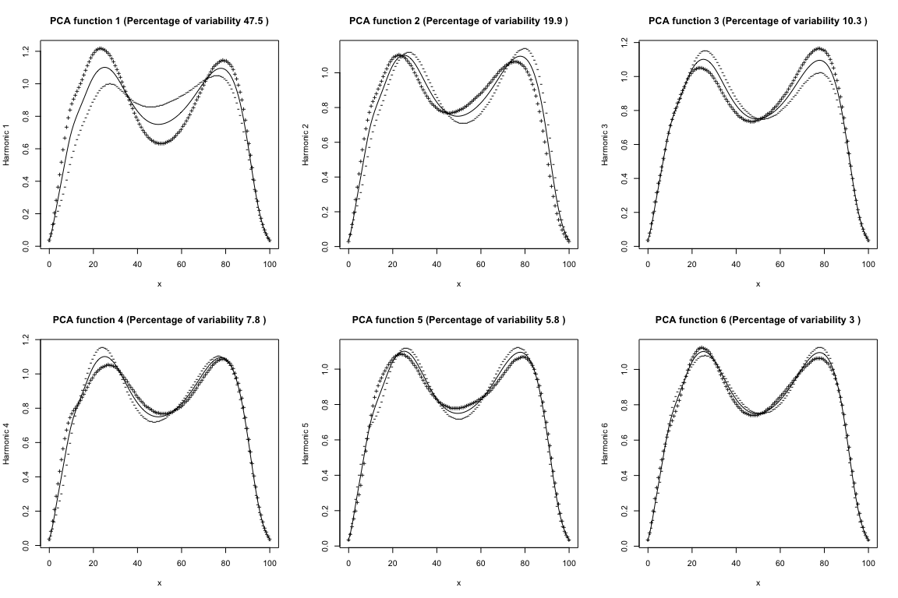

Part 3: Functional Principal Components Analysis
================

- [1 Load Packages](#1-load-packages)
- [2 Short Data Description](#2-short-data-description)
- [3 Load Data](#3-load-data)
- [4 Data Exploration](#4-data-exploration)
- [5 Applying FPCA](#5-applying-fpca)
- [6 Unpacking the `pca.fd()` object](#6-unpacking-the-pcafd-object)
- [7 Describing the FPCA](#7-describing-the-fpca)
- [8 FPCs as basis functions](#8-fpcs-as-basis-functions)
- [9 **Exercise:** Use the scores in downstream
  analysis](#9-exercise-use-the-scores-in-downstream-analysis)
- [10 References](#10-references)
- [11 Session Information
  (Reproducibility)](#11-session-information-reproducibility)

<center>

 


</center>

# 1 Load Packages

For this section, we just need the `fda` package.

``` r
library(fda) # load the fda package
```

# 2 Short Data Description

We have taken a sample of functional observations from the GaitRec
dataset (Horsak et al., 2020). These functional data represent the
vertical ground reaction force measured during walking using force
plates for a group of **Healthy controls**. They are defined on the
normalised time domain $[0. 100]$ where $0$ represents the start of the
stance phase when the foot touches the force plate and $100$ represents
the end. The force is normalised to body weight.

We also have a scalar variable, the **maximum anterior-posterior** force
produced during the same trial.

# 3 Load Data

You should download for this practical the dataset from [this
link](https://github.com/edwardgunning/ISBS-Short-Course/blob/main/practicals/fpca-data.rds)
and place it in your working directory. Then we load it and unpack the
objects as follows.

``` r
fpca_data <- readRDS(file = "fpca-data.rds")
grf_fd <- fpca_data$grf_fd # grf functional data object
max_ap <- fpca_data$max_ap # scalar max ap variable
t_grid <- 0:100 # grid of points we'll use to evaluate
```

# 4 Data Exploration

First we will simply plot the functions, which are stored in the
`grf_fd` object, using the `plot.fd()` function.

``` r
plot.fd(x = grf_fd, xlab = "t", ylab = "force (bw)")
```

    ## [1] "done"

``` r
title(main = "Vertical GRF")
```


Now, we can look at the sample mean function and the sample covariance
function.

## 4.1 Mean

``` r
mean_grf_fd <- mean.fd(x = grf_fd)
plot(mean_grf_fd, xlab = "t", ylab = "force (bw)")
```

    ## [1] "done"

``` r
title(main = "Sample Mean Vertical GRF")
```


## 4.2 Covariance Function

``` r
cov_grf_bifd <- var.fd(fdobj1 = grf_fd)
cov_grf_eval <- eval.bifd(sevalarg = t_grid, tevalarg = t_grid, bifd = cov_grf_bifd)
filled.contour(x = 0:100, y = 0:100, z = cov_grf_eval, xlab = "s", ylab = "t")
```


By looking at the diagonal from left to right which represents the
pointwise variance we see that the most variance is between $0$ and $20$
(dark red spots). We also see some negative dependence (very light
yellow) between at $s=50$, $t=20$ and at $s=80$, $t=50$ (and vice-versa
because the covariance function is symmetric). This indicates an inverse
relationship between function values at these pairs of points. That is,
for example, higher-than-average peaks at $t=20$ are associated with
lower-than-average dip in the middle of the curve at $t=20$. Now, lets
look at a more intuitive way of understanding the variation in the
vertical GRF curves using fpca.

# 5 Applying FPCA

We apply FPCA to our data using the `pca.fd()` function, with the
following arguments:

- `fdobj` this is the functional data object we apply FPCA to (in this
  case `grf_fd`)

- `nharm` this how many FPCs we want to extract, in our case we’ll
  extract the first $6$ (which we show later explain approximately
  $95\%$ of the variance).

- `harmfdPar` this is an `fdPar` object that can be used to represent
  the FPCs – we can use any basis and a smoothing penalty to represent
  them. We leave this argument blank so to use the default which is the
  same basis that’s being used to represent our data, with no smoothing
  penalty (note: in some situations, enforcing smoohtness in FPCs can be
  very beneficial).

``` r
grf_pca.fd <- pca.fd(fdobj = grf_fd, nharm = 6)
```

# 6 Unpacking the `pca.fd()` object

We can extract the following parts of the `pca.fd` object returned by
`pca.fd()`:

- The **FPC functions** are returned as a `fd` object named harmonics.

``` r
grf_fpc_funs_fd <- grf_pca.fd$harmonics
```

- The **FPC scores** are returned in an $N \times 6$ matrix.

``` r
grf_fpc_scores <- grf_pca.fd$scores
```

- The **eigenvalues**, which represent the **amount of variance
  explained** by the FPCs, are contained in a vector called `values`.

``` r
grf_eigenvalues <- grf_pca.fd$values
# actually shows all possible values, we just want first 6
grf_eigenvalues <- grf_eigenvalues[1:6]
```

- The **normalised eigenvalues** that represent the **proportion of
  variance explained** are contained in the vector called `varprop`.

``` r
grf_varprop <- grf_pca.fd$varprop
```

# 7 Describing the FPCA

First, let’s make a table displaying the amount of variance explained by
each FPC, as well as the cumulative amount of variance explained.

``` r
info_df <- data.frame(`FPC Number` = 1:6,
           `Eigenvalue` = round(grf_eigenvalues, 2),
           `Proportion of Variance` = round(grf_varprop, 2),
           `Cumulative Proportion of Variance` = cumsum(round(grf_varprop, 2)))

kableExtra::kable(info_df) # fancy table markdown output
```

| FPC.Number | Eigenvalue | Proportion.of.Variance | Cumulative.Proportion.of.Variance |
|-----------:|-----------:|-----------------------:|----------------------------------:|
|          1 |       0.20 |                   0.48 |                              0.48 |
|          2 |       0.09 |                   0.20 |                              0.68 |
|          3 |       0.04 |                   0.10 |                              0.78 |
|          4 |       0.03 |                   0.08 |                              0.86 |
|          5 |       0.02 |                   0.06 |                              0.92 |
|          6 |       0.01 |                   0.03 |                              0.95 |

Now, we can plot the FPCs as perturbations of the mean function using
`plot.pca.fd()`, passing the `pca.fd` object as our argument.

``` r
par(mfrow = c(2, 3))
plot.pca.fd(x = grf_pca.fd)
```


We can see that the first FPC (FPC1), which represents almost $50%$ of
variance, shows that high scorers (‘+’) have higher-than-average peaks
at $t=20$ and $t=80$ with lower-than-average dip in the middle of the
curve at $t=50$, reflecting the contrast we saw in the covariance
function contour plot.

We can also relate these to actual curves in the dataset, by looking at
the subjects with the highest and lowest FPC scores.

``` r
grf_fpc1_score <- grf_fpc_scores[,1]
max_ind <- which.max(grf_fpc1_score)
min_ind <- which.min(grf_fpc1_score)

par(mfrow = c(1, 2))
plot.pca.fd(x = grf_pca.fd, harm = 1)
plot(grf_fd[c(min_ind, max_ind)])
```

    ## [1] "done"

``` r
legend("bottom", 
       col = c(1,2), 
       lty = c(1, 2), 
       legend = c("Min FPC1 score", "Max FPC1 score"),
       "Lowest and Highest FPC1 Scorers")
```


We see that the curves on the right plot are the extrema of the curves
typified by the ‘-’ and ‘+’ on the left plot.

# 8 FPCs as basis functions

We can also interpret the FPCs as basis functions to approximate the
individual functional observations through the representation $$
x_i(t) \approx \bar{x}(t) + \sum_{r=1}^R \xi_{ir}\psi_{r}(t)
$$

where:

- $x_i$ is the $i$th curve

- $\bar{x}(t)$ is the sample mean function

- $\xi_{ir}$ is the $r$th FPC score for the $i$th curve

- $\psi_{r}(t)$ is the $r$th FPC function

Lets look at this approximation for the $1$st subject. We multiply the
scores (basis coefficients) by the FPCs (basis functions). To do this we
need to multiply the scores by the basis coefficients that represent the
FPCs.

``` r
subject_1_scores <- grf_fpc_scores[1, ]
new_coefs <- as.vector(subject_1_scores %*% t(grf_fpc_funs_fd$coefs))
scores_times_fpcs_fd <- fd(coef = new_coefs, basisobj = grf_fpc_funs_fd$basis)
approximation_subject_1_fd <- mean_grf_fd + scores_times_fpcs_fd
```

Now, let’s look at the reconstruction:

``` r
plot(approximation_subject_1_fd)
```

    ## [1] "done"

``` r
lines(grf_fd[1,], lty = 2)
legend("bottom", c("True", "FPC Approx"), lty = c(2, 1))
```


It’s pretty close, but we’ll need to use more than $6$ FPCs if we want
to improve it!

# 9 **Exercise:** Use the scores in downstream analysis

Use the FPC scores from the Vertical GRF to predict the scalar variable
of Maximum Anterior Posterior Force (`max_ap`) using a linear regression
model.

**Hint:** Use the `lm()` function.

# 10 References

- Horsak, B., Slijepcevic, D., Raberger, A.-M., Schwab, C., Worisch, M.,
  & Zeppelzauer, M. (2020). GaitRec, a large-scale ground reaction force
  dataset of healthy and impaired gait. Scientific Data, 7(1),
  Article 1. <https://doi.org/10.1038/s41597-020-0481-z>

- Publicly Available Data-Sharing Repository for Full GaitRec Dataset:
  <a href="https://doi.org:10.6084/m9.figshare.c.4788012.v1"
  class="uri">https://doi.org:10.6084/m9.figshare.c.4788012.v1</a>

- **Chapter 7 of** Ramsay, J. O., Hooker, G., & Graves, S. (2009).
  Functional Data Analysis with R and MATLAB. Springer-Verlag.
  <https://doi.org/10.1007/978-0-387-98185-7>

# 11 Session Information (Reproducibility)

``` r
sessionInfo()
```

    ## R version 4.4.1 (2024-06-14)
    ## Platform: aarch64-apple-darwin20
    ## Running under: macOS Sonoma 14.4
    ## 
    ## Matrix products: default
    ## BLAS:   /Library/Frameworks/R.framework/Versions/4.4-arm64/Resources/lib/libRblas.0.dylib 
    ## LAPACK: /Library/Frameworks/R.framework/Versions/4.4-arm64/Resources/lib/libRlapack.dylib;  LAPACK version 3.12.0
    ## 
    ## locale:
    ## [1] en_US.UTF-8/en_US.UTF-8/en_US.UTF-8/C/en_US.UTF-8/en_US.UTF-8
    ## 
    ## time zone: Europe/Dublin
    ## tzcode source: internal
    ## 
    ## attached base packages:
    ## [1] splines   stats     graphics  grDevices utils     datasets  methods  
    ## [8] base     
    ## 
    ## other attached packages:
    ## [1] fda_6.1.8       deSolve_1.40    fds_1.8         RCurl_1.98-1.14
    ## [5] rainbow_3.8     pcaPP_2.0-4     MASS_7.3-60.2  
    ## 
    ## loaded via a namespace (and not attached):
    ##  [1] Matrix_1.7-0       compiler_4.4.1     highr_0.11         xml2_1.3.6        
    ##  [5] stringr_1.5.1      ks_1.14.2          bitops_1.0-7       cluster_2.1.6     
    ##  [9] systemfonts_1.1.0  scales_1.3.0       yaml_2.3.8         fastmap_1.2.0     
    ## [13] lattice_0.22-6     R6_2.5.1           knitr_1.47         kableExtra_1.4.0  
    ## [17] munsell_0.5.1      svglite_2.1.3      rlang_1.1.4        hdrcde_3.4        
    ## [21] stringi_1.8.4      xfun_0.45          viridisLite_0.4.2  cli_3.6.3         
    ## [25] magrittr_2.0.3     digest_0.6.36      grid_4.4.1         rstudioapi_0.16.0 
    ## [29] mvtnorm_1.2-5      mclust_6.1.1       lifecycle_1.0.4    KernSmooth_2.23-24
    ## [33] evaluate_0.24.0    pracma_2.4.4       glue_1.7.0         colorspace_2.1-0  
    ## [37] rmarkdown_2.27     tools_4.4.1        htmltools_0.5.8.1
