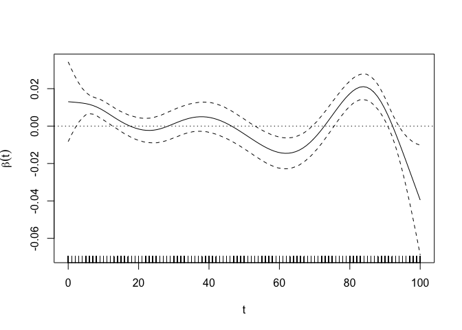

Part 4: Functional Regression
================

- <a href="#load-packages" id="toc-load-packages">Load Packages</a>
- <a href="#part-a-scalar-on-function-regression"
  id="toc-part-a-scalar-on-function-regression"><strong>Part (a)</strong>:
  Scalar-on-function Regression</a>
- <a href="#references" id="toc-references">References</a>
- <a href="#session-information-reproducibility"
  id="toc-session-information-reproducibility">Session Information
  (Reproducibility)</a>

<center>

 


</center>

# Load Packages

For this practical, we need the `fda` package and the `refund`
(“regression with functional data”) package.

``` r
library(fda) # load the fda package
library(refund) # load the refund package
```

# **Part (a)**: Scalar-on-function Regression

## Short Data Description

For part 1, we’ll use the same sample of data as practical 3, which come
from the GaitRec dataset (Horsak et al., 2020).

These functional data represent the vertical ground reaction force
measured during walking using force plates for a group of **Healthy
controls**. They are defined on the normalised time domain $[0. 100]$
where $0$ represents the start of the stance phase when the foot touches
the force plate and $100$ represents the end. The force is normalised to
body weight.

We also have a scalar variable, the **maximum anterior-posterior** force
produced during the same trial.

## Load Data

You should download for this practical the dataset from [this
link](https://github.com/edwardgunning/ISBS-Short-Course/blob/main/practicals/fpca-data.rds)
and place it in your working directory. Then we load it and unpack the
objects as follows.

``` r
fpca_data <- readRDS(file = "fpca-data.rds")
grf_fd <- fpca_data$grf_fd # grf functional data object
max_ap <- fpca_data$max_ap # scalar max ap variable
t_grid <- 0:100 # grid of points we'll use to evaluate
```

In the last practical, we applied FPCA to the Vertical GRF curves, and
used the FPC scores to predict maximum AP force. Let’s recap on the code
for this.

``` r
grf_pca.fd <- pca.fd(fdobj = grf_fd, nharm = 6)
grf_fpc_scores <- grf_pca.fd$scores
fpcr_df <- data.frame(grf_fpc_scores, max_ap)
names(fpcr_df)[1:6] <- paste0("fpc_", 1:6)
fpcr_lm <- lm(formula = max_ap ~ fpc_1 + fpc_2 + fpc_3 + fpc_4 + fpc_5 + fpc_6, 
   data = fpcr_df)
summary(fpcr_lm)
```

    ## 
    ## Call:
    ## lm(formula = max_ap ~ fpc_1 + fpc_2 + fpc_3 + fpc_4 + fpc_5 + 
    ##     fpc_6, data = fpcr_df)
    ## 
    ## Residuals:
    ##       Min        1Q    Median        3Q       Max 
    ## -0.035083 -0.010456  0.000236  0.009590  0.048059 
    ## 
    ## Coefficients:
    ##              Estimate Std. Error t value Pr(>|t|)    
    ## (Intercept)  0.214774   0.001322 162.502  < 2e-16 ***
    ## fpc_1        0.051091   0.002931  17.432  < 2e-16 ***
    ## fpc_2       -0.034378   0.004533  -7.584 4.47e-12 ***
    ## fpc_3        0.014826   0.006291   2.357  0.01985 *  
    ## fpc_4        0.042434   0.007233   5.866 3.14e-08 ***
    ## fpc_5       -0.011383   0.008395  -1.356  0.17735    
    ## fpc_6       -0.035593   0.011690  -3.045  0.00279 ** 
    ## ---
    ## Signif. codes:  0 '***' 0.001 '**' 0.01 '*' 0.05 '.' 0.1 ' ' 1
    ## 
    ## Residual standard error: 0.01592 on 138 degrees of freedom
    ## Multiple R-squared:  0.7493, Adjusted R-squared:  0.7384 
    ## F-statistic: 68.75 on 6 and 138 DF,  p-value: < 2.2e-16

This is a useful approach, but me way also prefer a model where we have
more flexibility in representing how the Vertical GRF curves affect the
maximum AP force. Thus, we posit the scalar-on-function linear
regression model
$$y_i^{AP} = \beta_0 + \int_0^{100} x_i^{V}(t) \beta_1(t) \mathrm{d}t.$$
Here, $\beta_1(t)$ is a smooth weight function that weights parts of the
Vertical GRF curves $x_i^{V}(t)$ to predict the maximum AP force
$y_i^{AP}$. Our goal is to estimate the function $\beta_1(t)$.

## Fitting with `pfr()`

Fitting this model with `pfr()` from the refund package is **really**
simple. We need to feed in the functional predictor evaluated on a grid
(note: manual says that we can supply `fd` object). For now, we just
evaluate at $0,1,2\dots,100$:

- `lf()` specifies a linear functional predictor of the form
  $\int x(t) \beta(t) \mathrm{d}t$.

- Use `bs = "bs"` for a “B-spline basis with integrated squared
  derivative penalties” (see `?mgcv::smooth.terms` for details).

``` r
grf_fd_eval <- t(eval.fd(evalarg = 0:100, fdobj = grf_fd))
pfr_fit <- pfr(max_ap ~ lf(X = grf_fd_eval, bs = "bs", k = 35, argvals = 0:100))
summary(pfr_fit)
```

    ## 
    ## Family: gaussian 
    ## Link function: identity 
    ## 
    ## Formula:
    ## max_ap ~ s(x = grf_fd_eval.tmat, by = L.grf_fd_eval, bs = "bs", 
    ##     k = 35)
    ## 
    ## Parametric coefficients:
    ##             Estimate Std. Error t value Pr(>|t|)
    ## (Intercept)  0.09297    0.12287   0.757    0.451
    ## 
    ## Approximate significance of smooth terms:
    ##                                     edf Ref.df     F p-value    
    ## s(grf_fd_eval.tmat):L.grf_fd_eval 8.039  8.882 51.83  <2e-16 ***
    ## ---
    ## Signif. codes:  0 '***' 0.001 '**' 0.01 '*' 0.05 '.' 0.1 ' ' 1
    ## 
    ## R-sq.(adj) =  0.761   Deviance explained = 77.5%
    ## -REML = -374.79  Scale est. = 0.00023118  n = 145

``` r
plot(pfr_fit, xlab = "t", ylab = expression(beta(t)))
abline(h =0, lty = 3)
```



Not surprisingly, the function $\widehat{\beta}_1(t)$ is largest (and
positive) at about $t=80%$, which is also approximately the time point
where the maximum AP force occurs in the stance phase. In other words,
producing a larger vertical force at this point is positively associated
with producing a larger AP force at this same instant.

## Fitting with `fRegress()`

We can also do this with the `fRegress()` function from the `fda`
package. We will not aim to go through it today, but essentially it
involves an ordinary cross-validation step to choose the smoothing
paraneter, as well as a adhering to a slightly strange requirement of
setting the scalar parameter $\beta_0$ up as a constant function. We do
not provide the code here but it can be found [at this
link](https://github.com/FAST-ULxNUIG/SpringerBriefs/blob/main/chapter-06/Case-Study-Part-02-MD.md#fregress).

# References

- Horsak, B., Slijepcevic, D., Raberger, A.-M., Schwab, C., Worisch, M.,
  & Zeppelzauer, M. (2020). GaitRec, a large-scale ground reaction force
  dataset of healthy and impaired gait. Scientific Data, 7(1),
  Article 1. <https://doi.org/10.1038/s41597-020-0481-z>

- Publicly Available Data-Sharing Repository for Full GaitRec Dataset:
  <a href="https://doi.org:10.6084/m9.figshare.c.4788012.v1"
  class="uri">https://doi.org:10.6084/m9.figshare.c.4788012.v1</a>

# Session Information (Reproducibility)

``` r
sessionInfo()
```

    ## R version 4.1.2 (2021-11-01)
    ## Platform: x86_64-apple-darwin17.0 (64-bit)
    ## Running under: macOS Big Sur 10.16
    ## 
    ## Matrix products: default
    ## BLAS:   /Library/Frameworks/R.framework/Versions/4.1/Resources/lib/libRblas.0.dylib
    ## LAPACK: /Library/Frameworks/R.framework/Versions/4.1/Resources/lib/libRlapack.dylib
    ## 
    ## locale:
    ## [1] en_IE.UTF-8/en_IE.UTF-8/en_IE.UTF-8/C/en_IE.UTF-8/en_IE.UTF-8
    ## 
    ## attached base packages:
    ## [1] splines   stats     graphics  grDevices utils     datasets  methods  
    ## [8] base     
    ## 
    ## other attached packages:
    ## [1] refund_0.1-26  fda_5.5.1      deSolve_1.30   fds_1.8        RCurl_1.98-1.6
    ## [6] rainbow_3.6    pcaPP_1.9-74   MASS_7.3-55    Matrix_1.4-0  
    ## 
    ## loaded via a namespace (and not attached):
    ##  [1] tidyselect_1.2.0   xfun_0.44          ks_1.13.4          lattice_0.20-45   
    ##  [5] colorspace_2.0-3   vctrs_0.6.2        generics_0.1.2     gamm4_0.2-6       
    ##  [9] htmltools_0.5.5    mgcv_1.8-42        yaml_2.3.5         utf8_1.2.2        
    ## [13] rlang_1.1.1        pracma_2.3.8       nloptr_2.0.0       pillar_1.9.0      
    ## [17] hdrcde_3.4         glue_1.6.2         lifecycle_1.0.3    munsell_0.5.0     
    ## [21] gtable_0.3.0       mvtnorm_1.1-3      evaluate_0.15      magic_1.6-0       
    ## [25] knitr_1.47         fastmap_1.1.0      RLRsim_3.1-6       parallel_4.1.2    
    ## [29] fansi_1.0.2        highr_0.11         Rcpp_1.0.10        pbs_1.1           
    ## [33] KernSmooth_2.23-20 scales_1.2.1       abind_1.4-5        lme4_1.1-30       
    ## [37] grpreg_3.4.0       ggplot2_3.4.2      digest_0.6.29      dplyr_1.1.2       
    ## [41] grid_4.1.2         cli_3.6.1          tools_4.1.2        bitops_1.0-7      
    ## [45] magrittr_2.0.2     tibble_3.2.1       cluster_2.1.2      pkgconfig_2.0.3   
    ## [49] minqa_1.2.4        rmarkdown_2.27     rstudioapi_0.13    R6_2.5.1          
    ## [53] mclust_5.4.9       boot_1.3-28        nlme_3.1-155       compiler_4.1.2
